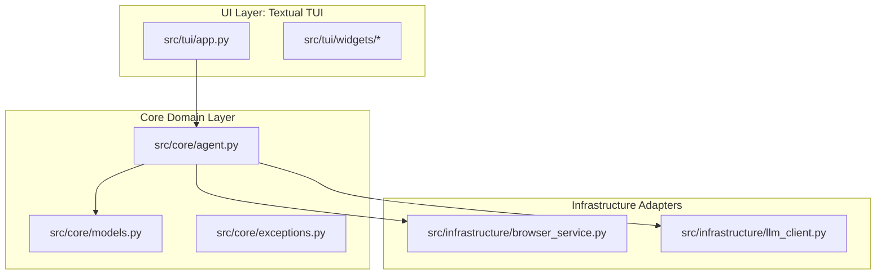
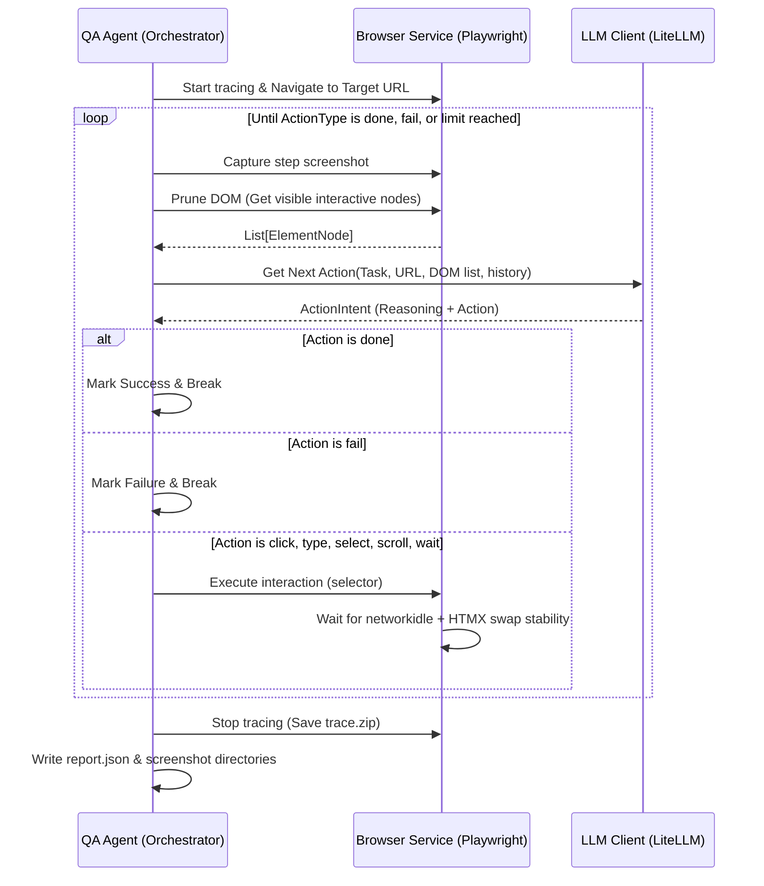

# ARCHITECTURE.md - Agentic QA Automation (pita)

This document provides a technical overview of the design and architecture of the **Python Interactive Testing Agent (pita)**.

---

## 1. Architectural Style: Hexagonal (Ports & Adapters)

To guarantee a clean separation of concerns, the system is divided into three distinct layers. There is no mixing of business logic with user interface rendering or browser execution details.

### 1.1 UI Layer (`src/tui/`)
- **App (`app.py`)**: Defines the terminal layout, binds keyboard events, and manages background task threads (workers) to execute the agent.
- **Widgets (`widgets/`)**:
  - `status_panel.py`: A reactive display rendering current URL, steps, execution states, and artifact file links.
  - `log_viewer.py`: Custom `RichLog` layout converting step-by-step reasoning, actions, errors, and success states into formatted Rich text.

### 1.2 Core Layer (`src/core/`)
- **Orchestrator (`agent.py`)**: Runs the central loop, coordinates browser steps, evaluates LLM choices, constructs execution history, and manages callback state updates. It is completely decoupled from Textual.
- **Models (`models.py`)**: Pydantic schemas enforcing data validation and output structure.
- **Exceptions (`exceptions.py`)**: Explicit, custom exception classes separating navigation, action, LLM, and loop failures.

### 1.3 Infrastructure Layer (`src/infrastructure/`)
- **Browser Service (`browser_service.py`)**: Playwright async API controller managing Chromium lifecycle, action executions, viewport screenshots, and DOM extraction.
- **LLM Client (`llm_client.py`)**: Abstraction layer wrapper for LiteLLM completion API, handling system prompt formatting, token reduction, and regex JSON parsing fallbacks.

---

## 2. The "Perceive-Act-Verify" Execution Loop

The agent runs an asynchronous loop processing pages iteratively until a goal is achieved, failed, or steps exceed the limit.

### 2.1 Perceive (DOM Pruning & Compressing)
Directly passing an entire HTML DOM tree to a local or cloud LLM causes token inflation and context window depletion. The DOM traversal runs in $\mathcal{O}(N)$ complexity where $N$ is only the count of visible, interactive nodes.
- Injects a JavaScript engine into the browser tab viewport.
- Extracts elements matching interactive nodes: `a`, `button`, `input`, `select`, `textarea`, `[onclick]`, `[role]`, etc.
- Discards elements with computed styles `display: none`, `visibility: hidden`, or zero bounding boxes.
- Assigns sequential dynamic QA identifiers (`data-qa-id="qa-x"`) if no stable IDs (`id`, `data-testid`) are found.
- Returns a list of `ElementNode`s containing only basic tags, labels, placeholders, and unique Playwright selectors.

### 2.2 Act (Reasoning & Structured Output)
The system instructs the LLM using a strict system prompt.
- **Chain of Thought (CoT)**: Enforces the generation of a `reasoning` justification explaining what is visible and why the action is selected.
- **Structured JSON schema**: Uses Pydantic to validate outputs. If the provider doesn't support JSON schemas, a fallback regex parser recovers JSON from within markdown blocks or raw text boundaries, performing self-validation.

### 2.3 Verify & Dynamic Wait
Vue.js and HTMX update the page asynchronously without full-page reloads.
- After every action, the system awaits `networkidle` state.
- Adds an additional config safety buffer (`page.wait_for_timeout`) allowing swap swaps and rendering animations to settle, preventing premature DOM readings.

---

## 3. Tracing and Documentation Artifacts

Every test run writes standard execution details into a timestamped directory inside `test_reports/run_YYYYMMDD_HHMMSS/`:
1. **`report.json`**: An audit trail documenting the goal, final status (success, failure, timeout), duration, and a step-by-step list of executed action types, reasoning, screenshots, and active selectors.
2. **`step_N.png`**: Viewport screenshots captured prior to each interaction step.
3. **`trace.zip`**: A standard Playwright trace zip file capturing timeline screenshots, network requests, console logs, and action execution snapshots. Use `playwright show-trace trace.zip` to run step-by-step debugging.
